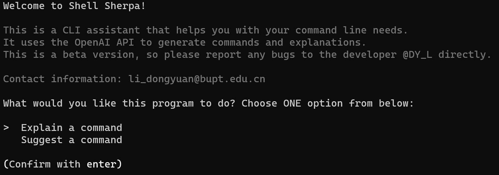
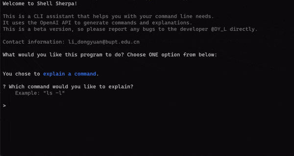

# Shell Sherpa
**Your Personal Assistant for Command Line Tasks**

> ### It is *strongly recommended* to read English version of README.md.
>
> But if you are more comfortable with reading the Chinese(中文), you can click [here](./README_ZH.md).

Shell Sherpa is a powerful tool designed to assist users with command line operations, functioning similarly to GitHub Copilot but for the CLI environment. Whether you're struggling to remember specific commands or looking for the best way to execute complex tasks, Shell Sherpa is here to guide you.

## Features
- **Command Explanation**: Understand what specific commands do and how to use them effectively.
- **Command Suggestion**: Get suggestions for commands based on your descriptive inputs.
- **User-Friendly Interaction**: Easy-to-follow prompts and options to help you navigate through your CLI tasks.

## Project Structure
```bash
shell-sherpa
├── .gitignore
├── README.md
├── requirements.txt
├── main.py
├── assistant.py
├── Dockerfile
├── misc
│   ├── startup.png
│   ├── explain.gif
│   └── suggest.gif
└── prompts
    ├── explain.txt
    └── suggest.txt
```

This section outlines the key components of the Shell Sherpa project, detailing the purpose and functionality of each essential file and directory.

### main.py

`main.py` serves as the central hub of the Shell Sherpa application, equipped with a range of features and functionalities that make it a powerful tool for CLI assistance:

1. **User Interaction Interface**: It acts as the primary interface for user interaction. Users can input commands or queries, which `main.py` processes to provide relevant responses.

2. **Command Explanation and Suggestion**: One of the key functionalities is to explain shell commands and suggest commands based on user input. This feature is particularly useful for beginners or those seeking to understand complex command line operations.

3. **Error Handling and User Guidance**: The script is robustly designed to handle exceptions and guide users through various interactions. This includes managing unsuccessful attempts at generating responses and providing users with options to retry or modify their queries.

4. **Integrating Assistant Module**: `main.py` integrates closely with the `assistant.py` module, utilizing it to communicate with the OpenAI API. This integration is seamless and is core to the functionality of Shell Sherpa.

5. **Interactive Command Execution**: Upon receiving a command suggestion, users have the option to directly execute the command within the interface. This feature adds a layer of convenience, allowing users to act on the suggestions immediately.

6. **User Experience Features**: The script includes user experience enhancements, such as loading spinners and syntax highlighting, to make the interaction more engaging and intuitive.

7. **Retry Logic**: In scenarios where the initial attempt to generate a response fails, `main.py` includes a retry mechanism, allowing users multiple attempts to get a satisfactory response.

### assistant.py

`assistant.py` is a crucial module in the Shell Sherpa application, primarily focused on interfacing with a free proxy of the OpenAI API. Its functionalities are tailored to leverage this external service effectively while ensuring the smooth operation of the application:

1. **Free Proxy OpenAI API Communication**: The standout feature of `assistant.py` is its ability to communicate with a free proxy of the OpenAI API. This means it sends user queries to a third-party service that acts as an intermediary, providing access to OpenAI's capabilities without direct API interaction.

2. **Handling API Responses**: It is responsible for handling the responses received from the free proxy service. This involves interpreting the data, ensuring it's in a usable format, and relaying it back to `main.py` for further processing.

3. **Modularity for Future Expansions**: While currently focused on interacting with a free proxy of the OpenAI API, `assistant.py` is built with modularity in mind. This design approach allows for future expansions or adaptations, such as integrating with different APIs or enhancing its current capabilities.

In summary, `assistant.py` plays a pivotal role in Shell Sherpa by managing the interaction with a free proxy OpenAI API. Its design is centered around efficient and reliable communication with this service, ensuring that users can benefit from AI-driven assistance in their command line operations.

### Dockerfile
Provides the instructions for building a Docker container for the Shell Sherpa project. The Dockerfile is based on Python 3.11 and includes steps for installing all dependencies listed in `requirements.txt`. This setup ensures consistent application performance across different environments.

## Getting Started

### Prerequisites
- Anaconda (Recommended, with Python 3.8+)
- Docker

### Installation

#### Using Git (Local Installation)
1. Clone the repository:
   ```bash
   git clone https://github.com/coffee3699/shell-sherpa.git
   ```
2. Navigate to the project directory:
   ```bash
   cd shell-sherpa
   ```
3. Install the necessary dependencies as specified in `requirements.txt`:
   ```bash
   pip install -r requirements.txt
   ```

#### Using Docker (Containerized Installation)
1. Pull the image from Docker Hub:
   ```bash
   docker pull dongyuanatbupt/shell-sherpa:latest
   ```
2. Run the container:
   ```bash
   docker run -it --rm --name shell-sherpa-instance dongyuanatbupt/shell-sherpa:latest
   ```

### Configuration
Create a `.env` file in the project directory and add your API key:
   ```env
   API_KEY=<YOUR_API_KEY>
   ```

## Usage & Demo
### Local
Run the program using the on-screen prompts:
```bash
python main.py
```

### Docker
After pulling the image, run the following command to start `Shell Sherpa`:
```bash
docker run -it --rm dongyuanatbupt/shell-sherpa:latest
```

### Command Line Interface
**The interface is quite intuitive and straightforward.** 

You will be prompted to choose between explaining a command and suggesting a command. 
Follow the prompts to get your desired output.

And there are also some emojis🌱❤️ to make the interface more friendly. 😄

#### Startup


#### Explain Command


#### Suggest Command


## Contributing & Support
Contributions, issues, and feature requests are **welcome** via GitHub issues and PRs.

If you have any questions, suggestions, or concerns, please feel free to contact me via email at [
li_dongyuan@bupt.edu.cn](mailto:li_dongyuan@bupt.edu.cn)

## License
This project is licensed under the terms of the MIT license.

## Acknowledgments
- ✨ Inspired by [GitHub Copilot for CLI](https://githubnext.com/projects/copilot-cli/).

- 🌺 Special thanks to [ai-shell](https://github.com/BuilderIO/ai-shell?tab=readme-ov-file), 
[command-ai](https://github.com/othema/command-ai) for open-sourcing their work in this field.
  - This project's success cannot be achieved without their prior work.

- 🌺 Special thanks to the [OpenAI API Free Reverse Proxy](https://github.com/PawanOsman/ChatGPT) for providing free 
reverse proxy to OpenAI API that allows users to access OpenAI API for free.
