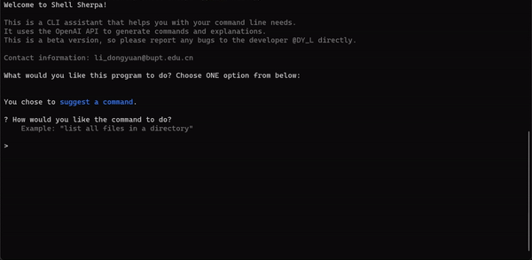

# Shell Sherpa
**Your Personal Assistant for Command Line Tasks**

Shell Sherpa is a powerful tool designed to assist users with command line operations, functioning similarly to GitHub Copilot but for the CLI environment. Whether you're struggling to remember specific commands or looking for the best way to execute complex tasks, Shell Sherpa is here to guide you.

## Features
- **Command Explanation**: Understand what specific commands do and how to use them effectively.
- **Command Suggestion**: Get suggestions for commands based on your descriptive inputs.
- **User-Friendly Interaction**: Easy-to-follow prompts and options to help you navigate through your CLI tasks.

## Getting Started

### Prerequisites
- Anaconda (Recommended, with Python 3.8+)
- Docker

### Installation

#### Using Git (Local Installation)
1. Clone the repository:
   ```bash
   git clone https://github.com/coffee3699/shell-sherpa.git
   ```
2. Navigate to the project directory:
   ```bash
   cd shell-sherpa
   ```
3. Install the necessary dependencies as specified in `requirements.txt`:
   ```bash
   pip install -r requirements.txt
   ```

#### Using Docker (Containerized Installation)
1. Pull the image from Docker Hub:
   ```bash
   docker pull dongyuanatbupt/shell-sherpa:latest
   ```
2. Run the container:
   ```bash
   docker run -it --rm --name shell-sherpa-instance dongyuanatbupt/shell-sherpa:latest
   ```

### Configuration
Create a `.env` file in the project directory and add your API key:
   ```env
   API_KEY=<YOUR_API_KEY>
   ```

## Usage
### Local
Run the program using the on-screen prompts:
```bash
python main.py
```

### Docker
After pulling the image, run the following command to start `Shell Sherpa`:
```bash
docker run -it --rm dongyuanatbupt/shell-sherpa:latest
```

### Command Line Interface
**The interface is quite intuitive and straightforward.** 

You will be prompted to choose between explaining a command and suggesting a command. 
Follow the prompts to get your desired output.

And there are also some emojis🌱❤️ to make the interface more friendly. 😄

#### Startup


#### Explain Command


#### Suggest Command


## Contributing & Support
Contributions, issues, and feature requests are **welcome** via GitHub issues and PRs.

If you have any questions, suggestions, or concerns, please feel free to contact me via email at [
li_dongyuan@bupt.edu.cn](mailto:li_dongyuan@bupt.edu.cn)

## License
This project is licensed under the terms of the [MIT license]().

## Acknowledgments
- ✨ Inspired by [GitHub Copilot for CLI](https://githubnext.com/projects/copilot-cli/).

- 🌺 Special thanks to [ai-shell](https://github.com/BuilderIO/ai-shell?tab=readme-ov-file), 
[command-ai](https://github.com/othema/command-ai) for open-sourcing their work in this field.
  - This project's success cannot be achieved without their prior work.

- 🌺 Special thanks to the [OpenAI API Free Reverse Proxy](https://github.com/PawanOsman/ChatGPT) for providing free 
reverse proxy to OpenAI API that allows users to access OpenAI API for free.