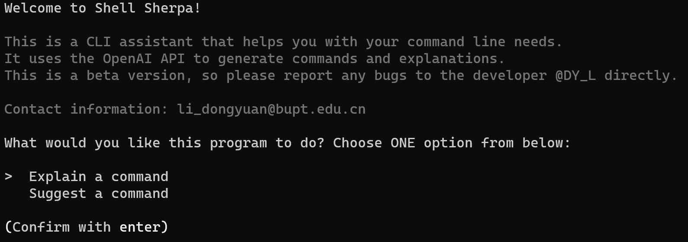
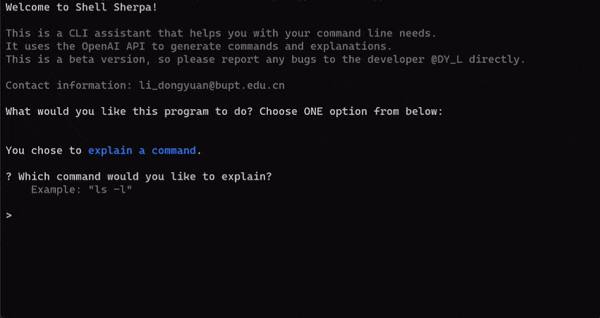

# Shell Sherpa
**您的命令行任务的个人助理**

Shell Sherpa 是一个为命令行操作设计的强大工具，功能上类似于 GitHub Copilot，但专门针对 CLI 环境。无论您是在努力回忆特定命令，还是寻找执行复杂任务的最佳方式，Shell Sherpa 都在此为您提供指导。

## 功能
- **命令解释**：理解特定命令的作用及如何有效使用它们。
- **命令建议**：根据您的描述性输入获取命令建议。
- **用户友好交互**：易于遵循的提示和选项，帮助您完成 CLI 任务。

## 项目结构
```bash
shell-sherpa
├── .gitignore
├── README.md
├── requirements.txt
├── main.py
├── assistant.py
├── Dockerfile
├── misc
│   ├── startup.png
│   ├── explain.gif
│   └── suggest.gif
└── prompts
    ├── explain.txt
    └── suggest.txt
```

本节概述了 Shell Sherpa 项目的关键组成部分，并详细介绍了每个文件和目录的目的及功能。

### main.py

`main.py` 作为 Shell Sherpa 应用程序的核心枢纽，配备了一系列功能和特性，使其成为 CLI 辅助的强大工具：

1. **用户交互界面**：它作为用户交互的主要界面。用户可以输入命令或查询，`main.py` 处理这些输入并提供相关响应。

2. **命令解释和建议**：其关键功能之一是解释 shell 命令和基于用户输入提出命令建议。这一功能对初学者或希望理解复杂命令行操作的用户特别有用。

3. **错误处理和用户指导**：该脚本设计得健壮，能够处理异常并引导用户进行各种交互。这包括管理生成响应的不成功尝试，并为用户提供重试或修改查询的选项。

4. **集成助手模块**：`main.py` 与 `assistant.py` 模块紧密集成，利用它与 OpenAI API 通信。这种集成是无缝的，是 Shell Sherpa 功能的核心。

5. **交互式命令执行**：在收到命令建议后，用户可以选择在界面内直接执行该命令。这一功能增加了便利性，允许用户立即采用建议。

6. **用户体验特性**：该脚本包括用户体验增强功能，如加载旋转器和语法高亮，使交互更加引人入胜和直观。

7. **重试逻辑**：在初始生成响应失败的情况下，`main.py` 包含了重试机制，允许用户多次尝试以获得满意的响应。

### assistant.py

`assistant.py` 是 Shell Sherpa 应用程序中的一个关键模块，主要专注于与 OpenAI API 的免费代理接口。其功能专为有效利用这种外部服务而设计，同时确保应用程序的顺畅运行：

1. **免费代理 OpenAI API 通信**：`assistant.py` 的突出特点是它能够与 OpenAI API 的免费代理进行通信。这意味着它将用户查询发送到充当中间人的第三方服务，提供对 OpenAI 功能的访问，无需直接与 API 交互。

2. **处理 API 响应**：它负责处理从免费代理服务收到的响应。这涉及解释数据，确保它们处于可用格式，并将它们传回 `main.py` 进行进一步处理。

3. **模块化未来扩展**：虽然目前专注于与 OpenAI API 的免费代理交互，`assistant.py` 设计上考虑了模块化。这种设计方法允许未来扩展或调整，例如集成不同的 API 或增强其当前功能。

总之，`assistant.py` 在 Shell Sherpa 中扮演着关键角色，通过管理与免费代理 OpenAI API 的交互，确保用户可以从 AI 驱动的辅助中受益，提高他们的命令行操作能力。

### Dockerfile
提供了构建 Shell Sherpa 项目 Docker 容器的指令。Dockerfile 基于 Python 3.11，并包括安装 `requirements.txt` 中列出的所有依赖项的步骤。这种设置确保应用程序在不同环境中表现一致。

## 入门

### 先决条件
- Anaconda（推荐，Python 3.8+）
- Docker

### 安装

#### 使用 Git（本地安装）
1. 克隆仓库：
   ```bash
   git clone https://github.com/coffee3699/shell-sherpa.git
   ```
2. 导航到项目目录：
   ```bash
   cd shell-sherpa
   ```
3. 安装 `requirements.txt` 中指定的必要依赖项：
   ```bash
   pip install -r requirements.txt
   ```

#### 使用 Docker（容器化安装）
1. 从 Docker Hub 拉取镜像：
   ```bash
   docker pull dongyuanatbell-sherpa:latest
   ```
2. 运行容器：
   ```bash
   docker run -it --rm --name shell-sherpa-instance dongyuanatbupt/shell-sherpa:latest
   ```

### 配置
在项目目录中创建一个 `.env` 文件，并添加您的 API 密钥：
   ```env
   API_KEY=<YOUR_API_KEY>
   ```

## 使用与演示
### 本地
使用屏幕上的提示运行程序：
```bash
python main.py
```

### Docker
拉取镜像后，运行以下命令以启动 `Shell Sherpa`：
```bash
docker run -it --rm dongyuanatbupt/shell-sherpa:latest
```

### 命令行界面
**界面非常直观且易于使用。**

系统将提示您选择解释命令和建议命令。根据提示获取所需的输出。

界面中还包含一些表情符号🌱❤️，使界面更加友好。😄

#### 启动


#### 解释命令


#### 建议命令


## 贡献与支持
欢迎通过 GitHub 问题和 PR 来进行贡献、问题和功能请求。

如果您有任何疑问、建议或关注，欢迎通过电子邮件联系我 [li_dongyuan@bupt.edu.cn](mailto:li_dongyuan@bupt.edu.cn)

## 许可证
该项目根据 MIT 许可证的条款授权。

## 致谢
- ✨ 灵感来自 [GitHub Copilot for CLI](https://githubnext.com/projects/copilot-cli/)。

- 🌺 特别感谢 [ai-shell](https://github.com/BuilderIO/ai-shell?tab=readme-ov-file)、
[command-ai](https://github.com/othema/command-ai) 因开源其在这一领域的工作。
  - 没有他们之前的工作，这个项目的成功是不可能实现的。

- 🌺 特别感谢 [OpenAI API 免费反向代理](https://github.com/PawanOsman/ChatGPT) 提供 OpenAI API 的免费反向代理服务，允许用户免费访问 OpenAI API。